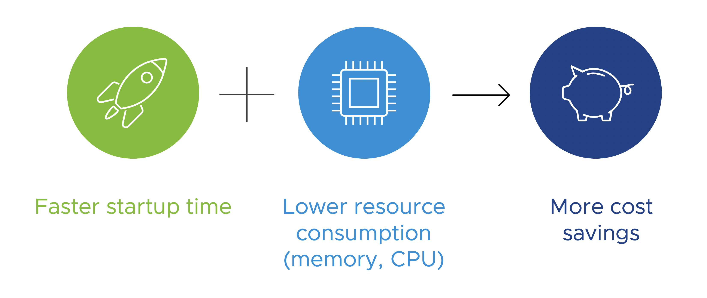
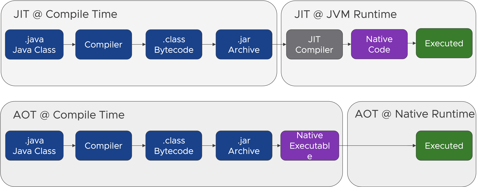

As we saw, the simple demo Spring Boot application worked well with the serverless runtime but there is room for improvement regarding the startup time and resource consumption to get the full potential out of the auto-scaling to reduce costs.

Let’s find out how you can improve both, the startup time and resource consumption.

##### Just-in-Time vs Ahead-of-Time

In traditional Java applications, Java code is compiled into Java ‘bytecode’ and packaged into a JAR archive. The Java Virtual Machine (JVM) then executes the java program contained in the Java Archive on the host platform with a  bytecode interpreter. 

The execution of Java bytecode by an interpreter is always slower than the execution of the same program compiled into a native machine language. This problem is mitigated by just-in-time (JIT) compilers. A JIT compiler translates Java bytecode into native machine language while executing the program for parts of a program that are frequently executed. The translated parts of the program can then be executed much more faster.  This way a JIT compiler can significantly speed up the overall execution time. The downside is that the JIT compliation impacts the application startup time and a Java program running on a Java Virtual Machine is always more resource consuming than native execution. 

With ahead-of-time compilation of the Java code to a standalone executable, called a native image, you are able to mitigate these problems and make your application start faster and consume fewer resources.

##### What are Native Images?
- Standalone executable of ahead-of-time compiled Java code
- Includes the application classes, classes from its dependencies, runtime library classes, and statically linked native code from JDK
- Runs without the need of a JVM, necessary components are included in a runtime system, called “Substrate VM” 
- Specific to the OS and machine architecture for which it was compiled
- Requires fewer resources, is samller, and faster than regular Java applications running on a JVM
