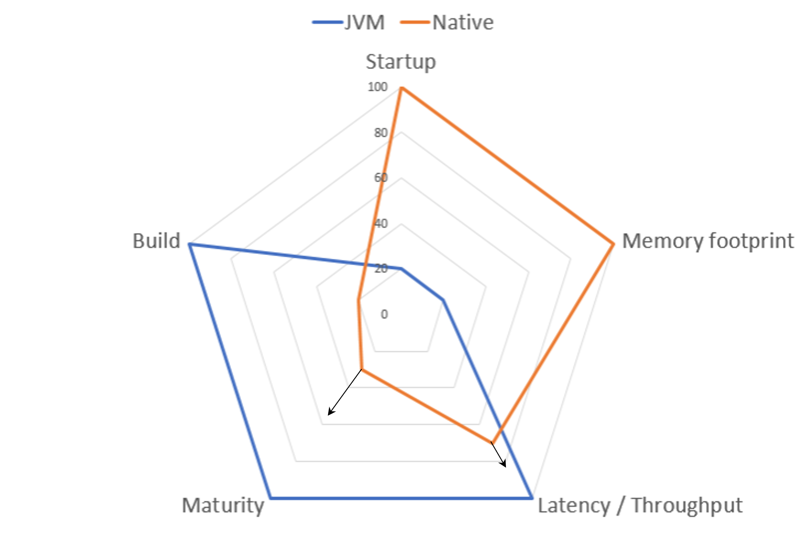

As we saw, the simple demo Spring Boot application worked well with the serverless runtime but there is **room for improvement regarding the startup time and resource consumption to get the full potential out of the auto-scaling to reduce costs**.

Let’s find out how you can improve both, the startup time and resource consumption.

##### Just-in-Time vs Ahead-of-Time

In **traditional** Java applications, **Java code is compiled into Java ‘bytecode’** and packaged into a JAR archive. The Java Virtual Machine **(JVM) then executes the Java program** contained in the Java Archive on the host platform **with a bytecode interpreter**. 

The **execution of Java bytecode by an interpreter is always slower** than the execution of the **same program compiled into a native machine language**. This problem is mitigated by **just-in-time (JIT) compilers**. 

A JIT compiler **translates Java bytecode into native machine language while executing the program for parts of a program that are frequently executed**. The translated parts of the program can then be **executed much faster**. This way a **JIT compiler can significantly speed up the overall execution time**. 

The **downside** is that the JIT compilation **impacts the application startup time** and a Java program running on a Java Virtual Machine is always **more resource consuming than native execution**. 

With **ahead-of-time compilation** of the Java code to a standalone executable, called a **native image**, you are able to mitigate these problems and make your **application start faster and consume fewer resources**.

##### What are native images?
- Standalone executable of ahead-of-time compiled Java code
- Includes the application classes, classes from its dependencies, runtime library classes, and statically linked native code from JDK
- Runs without the need of a JVM, necessary components like for memory management, thread scheduling, and so on are included in a runtime system, called “Substrate VM” 
- Specific to the OS and machine architecture for which it was compiled
- Requires fewer resources, is smaller, and faster than regular Java applications running on a JVM

The only way to do this at present is to use **GraalVM**, but in the future, similar technology may be available, like the OpenJDK Project Leyden. 

##### GraalVM - A high-performance JDK distribution
GraalVM is a high-performance JDK distribution by Oracle designed to **execute applications written in Java and other JVM languages** while **also providing runtimes for JavaScript, Ruby, Python, and a number of other popular languages**, which is made possible by **GraalVM’s Truffle language implementation framework**.

GraalVM **adds an advanced just-in-time (JIT) optimizing compiler**, which is written in Java, to the HotSpot Java Virtual Machine.

GraalVM offers **three runtime modes**:
- JVM runtime mode
- Native image 
- Java on Truffle for those none JVM languages

##### Tradeoffs between JVM and native images
**Native images** are able to **improve both, the startup time and resource consumption** for your applications deployed on a serverless runtime, but you have to keep in mind that there are some trade-offs compared to the JVM.

They **offer lower throughput and higher latency** because they can’t optimize hot paths during runtime as much as the JVM can. 
The **compilation takes much longer and consumes more resources**, which is bad for developer productivity. 
Finally, the **platform is also less mature**, but it evolves and improves quickly.
The native image plugin is available as an Early Adopter technology in GraalVM Enterprise and can be used in production, supported by Oracle as part of a paid GraalVM Enterprise subscription. However, it is not covered by Oracle’s standard warranty.

Additionally, VMware Tanzu offers Enterprise Support for Spring Boot Native Applications compiled with the BellSoft Liberica native image Kit which is based on GraalVM Open Source.

##### Key differences between JVM and GraalVM native image platform
The key differences between a regular JVM and this native image platform are that a **static analysis of your application from the main entry point is performed at build time** and the **unused parts will be removed**.
For **reflection, resources, and dynamic proxies upfront configuration is required** and the **Classpath is fixed at build time**.
**Class lazy loading is not possible** and there are some limitations around some aspects of Java applications that are not fully supported.
Finally, **some of the code will run at build time**.

Let‘s now have a look at how you can start with GraalVM native images for your Spring Boot application.

