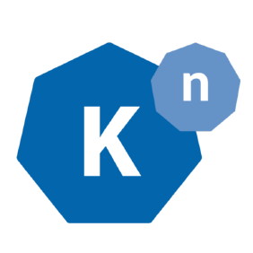

For the following demos, we'll use **Knative** as a Serverless runtime.

Knative is an open-source community project which adds components for **deploying, running, and managing applications on any Kubernetes in a Serverless way**.
Unlike earlier serverless frameworks, Knative is **designed to deploy any modern app workload from monolithic applications to microservices and functions**.
It consists of two primary components:
- **Serving**: Which provides middleware components that **enable rapid deployment, upgrading, routing, and automatic scaling of containers**.
- An **Eventing** system for **consuming and producing events** can be triggered by a variety of sources, such as events from your own apps or cloud services.

**Knative Serving** defines four objects that are used to define and control how a serverless workload behaves on the cluster: *Service*, *Configuration*, *Revision*, and *Route*.

**Configuration** is the statement of what the running system should look like. You provide details about the desired container image, environment variables, and the like. Knative converts this information into lower-level Kubernetes concepts like *Deployments*. 

**Revisions** are snapshots of a *Configuration*. Each time that you change a *Configuration*, Knative first creates a *Revision*, and in fact, it is the *Revision* that is converted into lower-level primitives. It’s the ability to selectively target traffic that makes *Revisions* a necessity.

A **Route** maps a network endpoint to one or more *Revisions*.

A **Service** combines a *Configuration* and a *Route*. This compounding makes common cases easier because everything you will need to know is in one place.

In the following sections, we'll use `kn`, the "official" CLI for Knative, to demonstrate some *Knative Serving* capabilities.